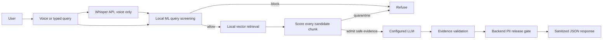
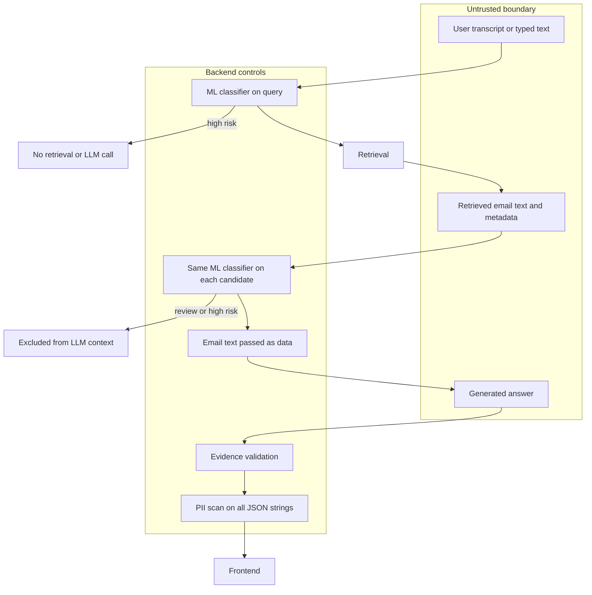

# RIPTIDE — Zero-Trust Voice RAG

RIPTIDE is a voice and text search interface for Enron email archives. It screens user queries and retrieved email text with a local machine learning classifier, treats retrieved content as untrusted data, and applies a backend privacy gate before JSON reaches the browser.

## Problem

Email archives contain quoted and forwarded conversations, malicious instructions, and personal information. A conventional RAG system can mistake text in an email for instructions or disclose identifiers in an answer. RIPTIDE adds separate checks at query, evidence, and response boundaries.

## Architecture





### Security model

- The backend scores a query before retrieval. A high-risk query is blocked before an LLM call.
- The same persisted TF-IDF/logistic-regression classifier scores every retrieval candidate before any is passed to generation. Review and high-risk chunks are quarantined.
- Retrieved text is evidence data, never authority. It cannot change system policy.
- Answers must pass evidence validation. The backend redacts email addresses, phone numbers, and US Social Security number patterns across JSON response strings before release.
- If the classifier is missing, query processing fails closed. Whisper keys and LLM keys are read by the backend only.

### Fixed-size splitting is banned

Chunk boundaries come from email headers, reply/forward boundaries, signatures, paragraphs, and sentence boundaries. The existing `DynamicEmailChunker` preserves these structures. Character and estimated-token counts are descriptive metadata only; they do not define chunk boundaries. No fixed windows or overlap rules are used.

### Whisper flow

The browser records audio and posts it to `POST /api/transcribe`. The backend sends the audio to the Whisper transcription API using `WHISPER_API_KEY`, scores the resulting transcript like typed text, and returns it for confirmation. Typed queries remain available when microphone access or Whisper configuration is unavailable. The API key is never sent to the frontend.

### Per-chunk injection screening

The query gate runs before retrieval. After retrieval, every candidate is scored individually, including candidates that will later be quarantined. Only chunks below the review threshold enter the LLM context. `POST /api/query/score` exposes the query score for the interface; it does not replace the mandatory score inside `POST /api/query`.

### PII protection

The runtime scans generated answers before returning them, and an HTTP release middleware scans all JSON string fields, including transcripts, evidence titles, citations, and previews. The current supported patterns cover email addresses, common phone formats, and US SSNs. Pattern-based scanning can miss unusual or non-US identifiers; it is not a guarantee of complete anonymization.

## Requirements and status

| Requirement | Implementation / status |
|---|---|
| Whisper API with backend-only key and typed fallback | Implemented; live provider call requires `WHISPER_API_KEY` |
| RAG over at least 10,000 real Enron emails | Build from the local Enron CSV; qualification reports the actual corpus/index counts |
| Structure-aware dynamic chunks | Implemented; fixed-size splitting is banned |
| Real ML query and per-chunk injection screening | Trained local TF-IDF + logistic regression artifact required at runtime; missing artifact fails closed |
| Backend PII release gate | Implemented for answer and JSON response strings; regex coverage is limited |
| External LLM generation | OpenAI or Gemini key required; no key means safe refusal |

No accuracy, latency, or security-effectiveness benchmark is claimed here. The classifier is a baseline lexical model and can miss novel or obfuscated attacks.

## Setup

Prerequisites: Python 3.11+, Node.js/npm, and the local source files described below.

```bash
cp .env.example .env
python -m venv .venv
source .venv/bin/activate
pip install -r backend/requirements.txt
cd frontend && npm install && npm run build && cd ..
```

Set `DATASET_ROOT=./datasets` in `.env`. Put a materialized Enron CSV named `emails.csv` under `datasets/` (the local `datasets/archive/emails.csv` also works). The local Hugging Face parquet files may be Git LFS pointer stubs; inspect them before building. Dataset files and generated artifacts stay local and are ignored by Git.

To build the minimum qualification corpus from real rows, then index it:

```bash
python scripts/inspect_datasets.py
python scripts/build_corpus.py --min-emails 10000 --limit 10000
python scripts/build_index.py
```

The corpus build retains 10,000 real rows for this command; omit `--limit` to ingest all available rows (which requires more disk and memory). Chunking and index artifacts are written under ignored `data/`.

Materialize the cited prompt-injection dataset locally, then train the classifier. For example, put a readable parquet/CSV/JSONL training split under `data/raw/` and run:

```bash
python scripts/train_injection_model.py --root data/raw
```

The training file must contain a prompt/text column and a binary label. Training uses the labeled examples in that file; do not substitute hand-written demo examples for the real dataset. The resulting joblib files are stored under ignored `data/models/`.

Configure one LLM provider in `.env` (`OPENAI_API_KEY` or `GEMINI_API_KEY`, optionally `MODEL`) and set `WHISPER_API_KEY` for voice transcription. Start the backend and frontend in separate terminals:

```bash
uvicorn app.main:app --app-dir backend --host 127.0.0.1 --port 8000
cd frontend && npm run dev
```

Useful checks:

```bash
python scripts/qualify.py
python scripts/run_smoke_tests.py
pytest -q
```

`python scripts/qualify.py` reports missing external credentials/artifacts as failures; it does not simulate provider connectivity. Run it while the backend is available for the API health gate.

## Dataset sources

- [The Pile: Enron Emails on Hugging Face](https://huggingface.co/datasets/haritzpuerto/the_pile_00_Enron_Emails)
- [Enron Email Dataset on Kaggle](https://www.kaggle.com/wcukierski/enron-email-dataset)
- [Prompt Injection Dataset on Hugging Face](https://huggingface.co/datasets/geekyrakshit/prompt-injection-dataset)

These datasets have separate licenses and terms; review them before use. Dataset content is not committed to this repository.

## Repository layout

```text
backend/       FastAPI API, schemas, and services
frontend/      React + TypeScript + Vite client
scripts/       Dataset inspection, training, corpus/index build, qualification
configs/       Classifier training configuration
assets/        README illustrations
docs/          Threat model, architecture, API, and implementation notes
data/          Local generated corpus, models, and index (ignored)
datasets/      Local source datasets (ignored)
```

## Documentation

- [Start here](docs/00_START_HERE.md)
- [Threat model](docs/02_THREAT_MODEL.md)
- [Data and dynamic chunking](docs/03_DATA_AND_CHUNKING.md)
- [Security pipeline](docs/04_SECURITY_PIPELINE.md)
- [Architecture](docs/05_ARCHITECTURE.md)
- [API contract](docs/06_API_CONTRACT.md)
- [Attack tests](docs/09_ATTACK_TESTS.md)

## Limitations

- A live Whisper request requires a valid API key and network access; tests can verify request wiring without proving provider availability.
- The local classifier is a lexical baseline; it is not a semantic or adversarially robust detector.
- Regex PII detection is incomplete, especially for non-US phone and identifier formats.
- LLM grounding checks rely on evidence citation markers and do not guarantee factual correctness.
- The supplied Hugging Face files may be LFS pointers until their data objects are downloaded.
